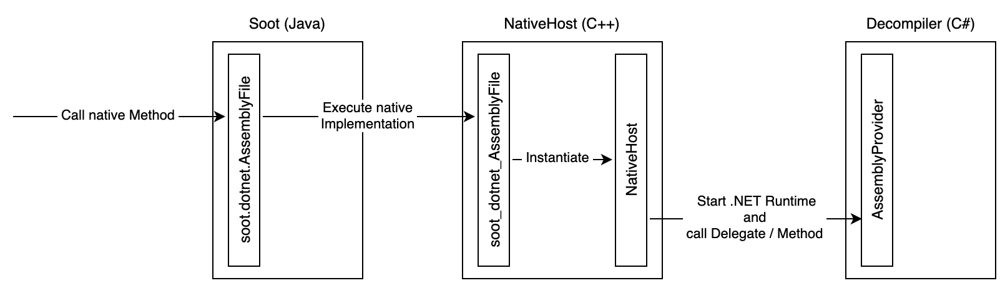

# Soot.Dotnet [![CC BY 4.0][cc-by-shield]][cc-by]

This project is part of my master's thesis to extend the static analysis framework Soot with .NET CIL support. Soot is mainly developed for Java and Java-like languages, such that we need three projects for the realization.

The main project for Soot is maintained on GitHub: https://github.com/soot-oss/soot 

## Project Structure
The whole work consists of three parts: The original Soot project (Java), a bridge project which hosts a custom .NET Core runtime (C++) and a managed library which uses APIs of the Open Source decompiler [ILSpy](https://github.com/icsharpcode/ILSpy) (C# on .NET Core). The Protobuf files are stored under Soot.Dotnet.Decompiler.Resources.

### Interaction Overview

## How to Run?
The C++ bridge was developed with Jetbrains CLion and the C# library with Jetbrains Rider. Compile the C++ bridge with CMake and the managed C# library with .NET (Core) and have a look at XXX.

Edit the CMakeLists.txt for the right paths of .NET.

## License
This work is licensed under a [Creative Commons Attribution 4.0 International License][cc-by].

[![CC BY 4.0][cc-by-image]][cc-by]

[cc-by]: http://creativecommons.org/licenses/by/4.0/
[cc-by-image]: https://i.creativecommons.org/l/by/4.0/88x31.png
[cc-by-shield]: https://img.shields.io/badge/License-CC%20BY%204.0-lightgrey.svg